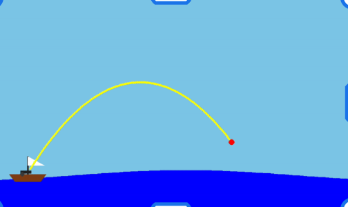
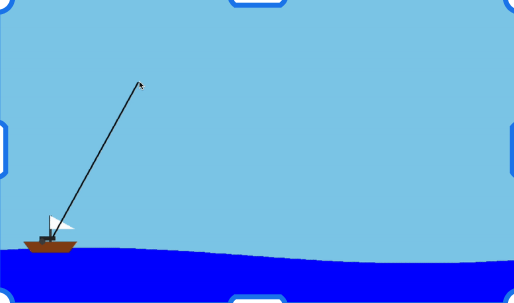

# Projectile Graphical Simulator
##  EECE2140 - Final Project
### Authors: Robert Halpern, Nathan Evans, Roha Sajid

#### Simple projectile simulation program in Python:


Our simulator __requires__ the use of the following libraies: 
``` 
Pygame, math, csv, os, matplotlib, glob, and sys
```
 Please install them (likely via __pip__) before running.

1. Our project is a fun way to simulate projectile motion with a pirate theme while still insuring real world accuracy. 


2. To run our code, run the main.py file, This will open a new window with a ship on waves. 

3. Using your mouse, you can drag where you'd like to aim the cannon and, by dragging your mouse farther away from the ship, you can control the velocity of the projectile. Every time you fire the cannon, the trajectory of the cannonball is saved as a .csv file which you can be viewed in greater detail as a graph using graph.py. 

```
python graph.py trajectory_xxxxxxxx_xxxxxx.csv
```
If you just want to open a detailed graph of your most recent shot, you can instead just type: 
```
python graph.py
```
and the program will automatically open the most recent saved trajectory.



